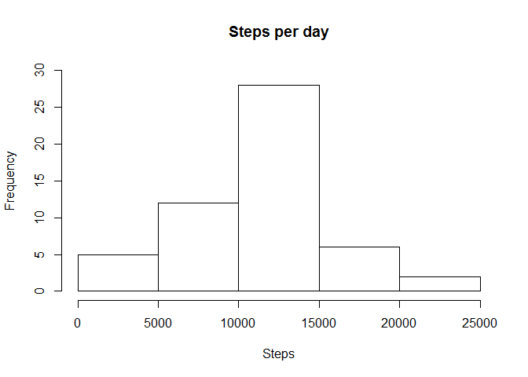

# Reproducible Research: Peer Assessment 1

This is assignment 1 for Reproducable Research. 
This file contains explaination and code required to process activity data as 
directed. 

Load required library:

```r
library(plyr)
```


## Loading and preprocessing the data


```r
a <- read.csv("../data/activity.csv")
af <- a[complete.cases(a),]
```


## What is mean total number of steps taken per day?

The next code block calculates the sums of steps per day and generates a 
histogram of them. 


```r
sums <- aggregate(af[, 1], list(af$date), sum)
hist(sums[,2], main="Steps per day", ylim = c(0,30), xlab="Steps")
```

 

The mean and median are calculated: 


```r
mean(sums[,2])
```

```
## [1] 10766.19
```

```r
median(sums[,2])
```

```
## [1] 10765
```


## What is the average daily activity pattern?

Plot the daily average steps per time slices: 

```r
slices <- aggregate(af[, 1], list(af$interval), mean)
plot(slices[,1], slices[,2], type="l", xlab = "Time slice", ylab = "Mean steps")
```

 

Find the time slice with the greatest average number of steps:


```r
slices$Group.1[slices$x == max(slices$x)]
```

```
## [1] 835
```

## Imputing missing values

Count the number of NA values for "Steps:


```r
sum(is.na(a$steps))
```

```
## [1] 2304
```

Replace missing values with the mean value for that interval


```r
impute.mean <- function(x) replace(x, is.na(x), mean(x, na.rm = TRUE))
a2 <- ddply(a, ~ interval, transform, steps = impute.mean(steps))
a2<- a2[order(a2$date, a2$interval), ] 
```

Make a histogram of the total number of steps taken each day


```r
sums2 <- aggregate(a2[, 1], list(a2$date), sum)
hist(sums2[,2], main="Steps per day", ylim = c(0,40), xlab="Steps")
```

 

The mean and median are calculated: 


```r
mean(sums2[,2])
```

```
## [1] 10766.19
```

```r
median(sums2[,2])
```

```
## [1] 10766.19
```

The mean is unchanged but the median has changed to the mean. 

## Are there differences in activity patterns between weekdays and weekends?


```r
a2$dayOfWeek <- as.factor(weekdays(as.Date(a2$date)))
a2$dayType <- as.factor("Weekday")
levels(a2$dayType)[2] <- "Weekend"
a2[which(a2[,4] == "Saturday" | a2[,4] == "Sunday" ), 5] <- "Weekend"
weekdays <- a2[which(a2[,5] == "Weekday"), ]
weekdaySums <- aggregate(weekdays[, 1], list(weekdays$interval), sum)
weekend <- a2[which(a2[,5] == "Weekend"), ]
weekendSums <- aggregate(weekend[, 1], list(weekend$interval), sum)

par(mfrow=c(2,1), mai = c(.3, 0, 0.3, 0), oma = c(3,3,3,3))
plot(1:nrow(weekendSums),weekendSums$x-mean(weekendSums$x), type="l",
     ylab = "", xlab = "", main = "weekend", col = "blue", xaxt="n")
plot(1:nrow(weekdaySums),weekdaySums$x-mean(weekdaySums$x), type="l",
     ylab = "", xlab = "", main = "weekday", col = "blue", xaxt="n")
axis(1, at=c(0,50,100,150,200, 250), labels=c(0,250,500,750,1000, 1250))
```

 

```r
##a2$intervalSeconds <- paste(a2$interval, "00", sep = "")
##paste(a2$date, a2$interval)
##plot((as.numeric(a2$date) - 1)*1440 + a2$interval, a2$steps-mean(a2$steps), 
##     type="l", ylim = c(-200, 1000))
```
